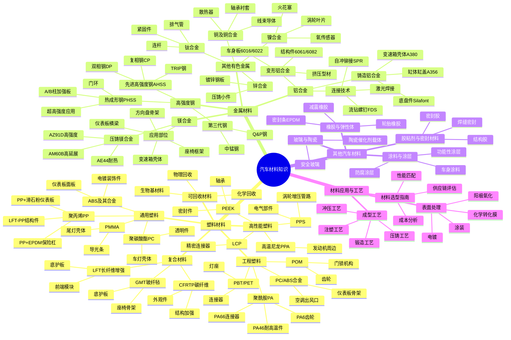

# 汽车材料知识思维导图

---

## 导图说明

本思维导图涵盖了汽车材料的四大核心领域：

### 1. 塑料材料（用量最大，约250-300kg/车）
- 通用塑料：PP、ABS、PC 等，占汽车塑料70%以上
- 工程塑料：PA、PBT、POM 等，用于结构件和耐磨件
- 高性能塑料：PPS、PEEK 等，用于高温高负荷场合
- 复合材料：LFT、碳纤维等，用于替代金属减重
- 可回收材料：符合环保趋势的新型材料

### 2. 金属材料（车身结构核心）
- 高强度钢：从HSS到第三代AHSS，强度不断提升
- 铝合金：铸造+变形铝，轻量化首选
- 镁合金：最轻结构金属，密度仅为铝的2/3
- 其他有色金属：铜、钛、锌、镍等特种应用

### 3. 其他汽车材料
- 橡胶弹性体：密封、减震、轮胎
- 涂料涂层：防腐、装饰、功能性
- 胶粘密封：结构连接、密封防水
- 玻璃陶瓷：视野、催化、隔热

### 4. 材料应用与工艺
- 选型方法论
- 成型工艺技术
- 表面处理方案

---

## 快速参考

| 材料类别 | 主要优势 | 典型减重 | 成本等级 |
|---------|---------|---------|---------|
| 高强度钢 | 成本低，工艺成熟 | 10-40% | ★★☆☆☆ |
| 铝合金 | 比强度高，可回收 | 30-50% | ★★★☆☆ |
| 镁合金 | 最轻结构金属 | 40-60% | ★★★★☆ |
| 碳纤维 | 超高比强度 | 50-70% | ★★★★★ |
