# 白车身知识库思维导图

```mermaid
mindmap
  root((白车身知识库<br/>BIW Knowledge))
    
    %% ==================== 文档结构 ====================
    基础概念(01-基础概念)
      01_白车身定义["01-白车身定义与组成.md 🟢"]
        🟢已完成: 白车身权威定义、核心属性
        🟢已完成: 整车开发地位、发展历程
        路径: 01-基础概念/白车身定义与组成.md
      02_结构分类["02-车身结构分类.md 🟢"]
        🟢已完成: 承载式vs非承载式对比
        🟢已完成: 电动车车身特点
        路径: 01-基础概念/车身结构分类.md
      03_电动车特点["03-电动车白车身特点.md 🟢"]
        🟢已完成: 载荷分布差异、核心设计重点
        🟢已完成: CTC/CTB/CIB技术趋势
        路径: 01-基础概念/电动车白车身特点概述.md
    
    结构系统(02-结构系统)
      01_地板总成["01-地板总成.md 🟢"]
        🟢已完成: 地板面板、加强梁系
        🟢已完成: 电动车地板集成设计
        路径: 02-结构系统/地板总成.md
      02_侧围总成["02-侧围总成.md 🟢"]
        🟢已完成: 侧围内外板、加强件系统
        🟢已完成: 电动车侧围特殊设计
        路径: 02-结构系统/侧围总成.md
      03_前后舱结构["03-前后舱结构.md 🟢"]
        🟢已完成: 前舱、后舱结构设计
        🟢已完成: 一体化压铸应用
        路径: 02-结构系统/前后舱结构.md
      04_四门两盖["04-四门两盖.md 🟢"]
        🟢已完成: 车门结构、机盖、尾门
        🟢已完成: 电动车轻量化方案
        路径: 02-结构系统/四门两盖.md
      05_电池包集成["05-电池包集成结构.md 🟢"]
        🟢已完成: 电池包角色演变
        🟢已完成: 边框/底板/上盖设计
        路径: 02-结构系统/电动车专属：电池包集成结构.md
    
    材料技术(03-材料技术)
      01_钢材体系["01-钢材体系.md 🟢"]
        🟢已完成: 普通钢到热成型钢等级
        🟢已完成: 钢材应用分布、供应商
        路径: 03-材料技术/钢材体系.md
      02_铝合金["02-铝合金应用.md 🟢"]
        🟢已完成: 5/6/7系铝合金特性
        🟢已完成: 连接技术(SPR/FSW)
        路径: 03-材料技术/铝合金应用.md
      03_碳纤维["03-碳纤维复合材料.md 🟢"]
        🟢已完成: CFRP性能优势、制造工艺
        🟢已完成: 电动车应用案例
        路径: 03-材料技术/碳纤维复合材料.md
      04_多材料混合["04-多材料混合车身.md 🟢"]
        🟢已完成: 分区材料策略
        🟢已完成: 拓扑优化方法
        路径: 03-材料技术/多材料混合车身设计.md
    
    电动车核心(04-电动车核心技术)
      01_CTC_CTB_CIB["01-CTC-CTB-CIB技术.md 🟢"]
        🟢已完成: 三种技术路线详解
        🟢已完成: 特斯拉/比亚迪/华为方案
        路径: 04-电动车核心技术/CTC-CTB-CIB技术详解.md
      02_电池车身一体化["02-电池车身一体化.md 🟢"]
        🟢已完成: 设计理念变革
        🟢已完成: 关键设计技术
        路径: 04-电动车核心技术/电池车身一体化设计.md
      03_电池包壳体["03-电池包壳体结构.md 🟢"]
        🟢已完成: 壳体功能、组成
        🟢已完成: 制造工艺、材料选择
        路径: 04-电动车核心技术/电池包壳体结构.md
      04_碰撞安全["04-电动车碰撞安全.md 🟢"]
        🟢已完成: 电池保护设计
        🟢已完成: 正/侧/底部碰撞策略
        路径: 04-电动车核心技术/电动车碰撞安全.md
      05_热管理集成["05-热管理与车身集成.md 🟢"]
        🟢已完成: 热管理架构
        🟢已完成: 液冷板集成设计
        路径: 04-电动车核心技术/热管理与车身集成.md
    
    制造工艺(05-制造工艺)
      01_冲压工艺["01-冲压工艺.md 🟢"]
        🟢已完成: 冲压工序、设备
        🟢已完成: 高强钢/热成型工艺
        路径: 05-制造工艺/冲压工艺.md
      02_焊接连接["02-焊接与连接技术.md 🟢"]
        🟢已完成: 点焊、激光焊
        🟢已完成: SPR/FDS/FSW
        路径: 05-制造工艺/焊接与连接技术.md
      03_涂装工艺["03-涂装工艺.md 🟢"]
        🟢已完成: 前处理、电泳、面漆
        🟢已完成: 环保与节能
        路径: 05-制造工艺/涂装工艺.md
      04_一体化压铸["04-一体化压铸技术.md 🟢"]
        🟢已完成: 特斯拉引领的革命
        🟢已完成: 免热处理铝合金
        路径: 05-制造工艺/一体化压铸技术.md
    
    设计方法(06-设计方法与验证)
      01_平台化模块化["01-平台化与模块化.md 🟢"]
        🟢已完成: 平台化优势
        🟢已完成: 电动车平台特点
        路径: 06-设计方法与验证/平台化与模块化设计.md
      02_CAE仿真["02-CAE仿真驱动设计.md 🟢"]
        🟢已完成: 结构/碰撞/NVH仿真
        🟢已完成: 优化技术
        路径: 06-设计方法与验证/CAE仿真驱动设计.md
      03_刚度强度["03-刚度与强度分析.md 🟢"]
        🟢已完成: 弯曲/扭转刚度
        🟢已完成: 疲劳强度
        路径: 06-设计方法与验证/刚度与强度分析.md
      04_碰撞安全设计["04-碰撞安全设计.md 🟢"]
        🟢已完成: 正/侧/追尾碰撞
        🟢已完成: 碰撞仿真技术
        路径: 06-设计方法与验证/碰撞安全设计.md
      05_NVH优化["05-NVH性能优化.md 🟢"]
        🟢已完成: 模态/刚度指标
        🟢已完成: 阻尼与隔声设计
        路径: 06-设计方法与验证/NVH性能优化.md
    
    行业案例(07-行业案例)
      01_特斯拉压铸["01-特斯拉一体化压铸.md 🟢"]
        🟢已完成: Model Y/Cybertruck案例
        🟢已完成: 9000吨压铸机
        路径: 07-行业案例/特斯拉一体化压铸案例.md
      02_比亚迪CTB["02-比亚迪CTB技术.md 🟢"]
        🟢已完成: CTB技术原理
        🟢已完成: 刀片电池、40,500刚度
        路径: 07-行业案例/比亚迪CTB技术.md
      03_小米华为["03-小米华为一体化.md 🟢"]
        🟢已完成: 华为CIB专利
        🟢已完成: 小米电池车身专利
        路径: 07-行业案例/小米-华为电池车身一体化.md
      04_平台对比["04-主流平台对比.md 🟢"]
        🟢已完成: 特斯拉/比亚迪/MEB/E-GMP
        🟢已完成: 800V/400V平台对比
        路径: 07-行业案例/主流电动车平台对比.md
    
    %% ==================== 存储结构 ====================
    存储结构(目录层级)
      tasks/白车身知识/
        ├── 01-基础概念/       (3篇)
        │   ├── 白车身定义与组成.md
        │   ├── 车身结构分类.md
        │   └── 电动车白车身特点概述.md
        ├── 02-结构系统/       (5篇)
        │   ├── 地板总成.md
        │   ├── 侧围总成.md
        │   ├── 前后舱结构.md
        │   ├── 四门两盖.md
        │   └── 电动车专属：电池包集成结构.md
        ├── 03-材料技术/       (4篇)
        │   ├── 钢材体系.md
        │   ├── 铝合金应用.md
        │   ├── 碳纤维复合材料.md
        │   └── 多材料混合车身设计.md
        ├── 04-电动车核心技术/ (5篇)
        │   ├── CTC-CTB-CIB技术详解.md
        │   ├── 电池车身一体化设计.md
        │   ├── 电池包壳体结构.md
        │   ├── 电动车碰撞安全.md
        │   └── 热管理与车身集成.md
        ├── 05-制造工艺/       (4篇)
        │   ├── 冲压工艺.md
        │   ├── 焊接与连接技术.md
        │   ├── 涂装工艺.md
        │   └── 一体化压铸技术.md
        ├── 06-设计方法与验证/ (5篇)
        │   ├── 平台化与模块化设计.md
        │   ├── CAE仿真驱动设计.md
        │   ├── 刚度与强度分析.md
        │   ├── 碰撞安全设计.md
        │   └── NVH性能优化.md
        ├── 07-行业案例/       (4篇)
        │   ├── 特斯拉一体化压铸案例.md
        │   ├── 比亚迪CTB技术.md
        │   ├── 小米-华为电池车身一体化.md
        │   └── 主流电动车平台对比.md
        ├── 白车身知识库-思维导图.md
        └── README.md
    
    %% ==================== 核心知识点 ====================
    核心知识点
      白车身定义
        完成焊接但未涂装的车身总成
        被称为"汽车之骨"
      电动车特点
        电池包重量占整车30-40%
        扭转刚度目标>35,000 N·m/deg
      CTC/CTB/CIB
        CTC: 电芯到底盘（特斯拉）
        CTB: 电芯到车身（比亚迪）
        CIB: 电芯在车身内（华为/小米）
      一体化压铸
        零件数量减少90%+
        制造时间缩短95%
        特斯拉6000T→9000T→12000T
      材料体系
        钢材: 热成型钢1500MPa
        铝合金: 6/7系挤压型材
        碳纤维: 比强度是钢10倍
    
    %% ==================== 更新规则 ====================
    Git提交规范
      feat: 新文档/新功能
      refactor: 结构调整
      update: 内容更新
      fix: 错误修正
    
    编辑规则
      ✅ 允许: 用户明确指令
      ❌ 禁止: 用户未授权/AI推测
```

---

## 状态看板

### 标记系统

| 标记 | 含义 | 处理优先级 |
|------|------|-----------|
| 🔴 | 【缺失】内容未创建 | 高 |
| ⚠️ | 【需修改】需更新修正 | 中 |
| 🟡 | 【待确认】数据需核实 | 中 |
| 🔵 | 【待补充】可后续完善 | 低 |
| 🟢 | 【已完成】已完成创建 | 完成 |

### 当前文档统计

| 编号 | 领域 | 文档数 | 状态 |
|------|------|--------|------|
| 01 | 基础概念 | 3篇 | 🟢 完成 |
| 02 | 结构系统 | 5篇 | 🟢 完成 |
| 03 | 材料技术 | 4篇 | 🟢 完成 |
| 04 | 电动车核心技术 | 5篇 | 🟢 完成 |
| 05 | 制造工艺 | 4篇 | 🟢 完成 |
| 06 | 设计方法与验证 | 5篇 | 🟢 完成 |
| 07 | 行业案例 | 4篇 | 🟢 完成 |
| **总计** | | **30篇** | 🟢 **全部完成** |

### 文档规模统计

| 统计项 | 数值 |
|--------|------|
| 总文档数 | 30篇 |
| 总字数 | 约9万字 |
| 覆盖领域 | 7大模块 |
| 电动车专项 | 8篇 |

---

**版本**: v1.0  
**创建日期**: 2026-03-29  
**更新日期**: 2026-03-29  
**重要变更**: 
- 初始创建，完成30篇文档
- 覆盖白车身基础概念、结构、材料、电动车技术、制造工艺、设计方法、行业案例
- 重点突出电动车白车身CTC/CTB/一体化压铸技术
